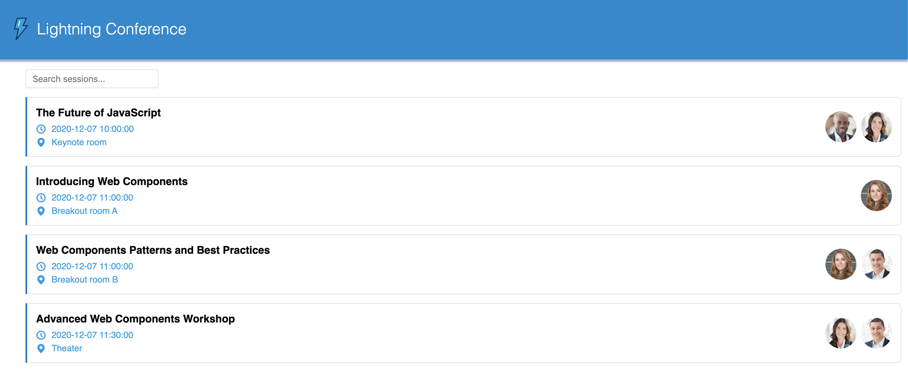

# Conference App

Here will be some information about the app.

## How to start?

Start simple by running `yarn watch` (or `npm run watch`, if you set up the project with `npm`). This will start the project with a local development server.

The source files are located in the [`src`](./src) folder. All web components are within the [`src/modules`](./src/modules) folder. The folder hierarchy also represents the naming structure of the web components.

Find more information on the main repo on [GitHub](https://github.com/muenzpraeger/create-lwc-app).

Link to the application deployed on Heroku: https://conference-lwc-app.herokuapp.com

[Learn to build the applicaton at Trailhead](https://trailhead.salesforce.com/content/learn/projects/build-your-first-app-with-lightning-web-components-open-source/create-the-application)
